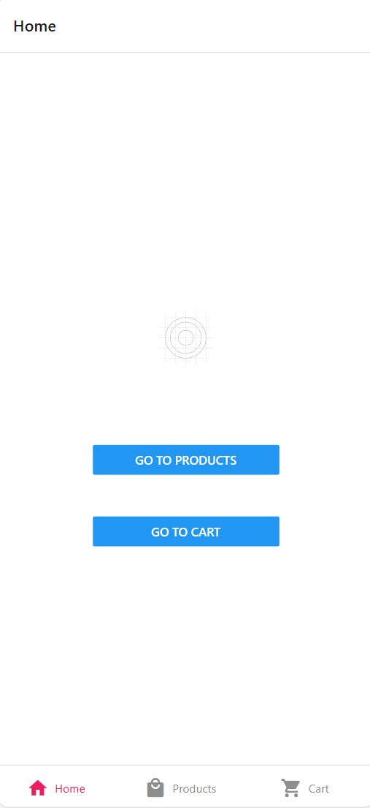

# 购物商城APP
### 作者
- 上海大学 杨盟佳
## 项目简介
- 本项目是一个购物商城APP，主要功能有：用户注册登录、商品浏览、商品搜索、商品详情、购物车、订单结算、订单支付、订单查询、订单评价、个人中心等。

## 项目功能
- 用户注册登录
- 商品浏览、添加购物车
- 购物车管理、结算选中商品

## 项目技术
- 使用redux管理状态
- 使用react-navigation实现页面导航
- 使用fetch请求本地数据（assets/data）

## 项目结构
- assets: 静态资源
- components: 公共组件
- redux: 状态管理

## 项目运行
- 安装依赖：`npm install`
- 运行项目：`npx expo start`

## 项目截图
- 
- 
- 